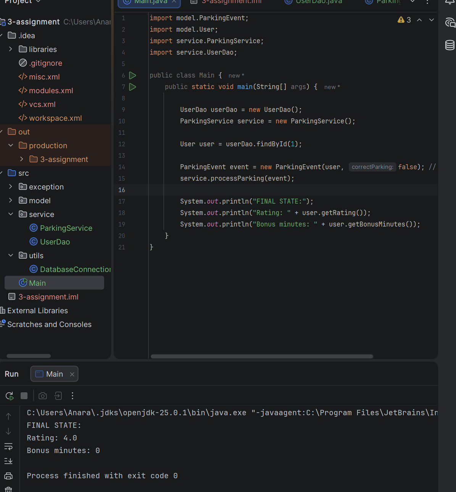

# 3-assignment

## Project Structure

The project follows a layered architecture:
- controller – handles incoming requests
- service – contains business logic
- repository – works with data source
- model – contains entity classes
- exception – custom exceptions
- utils – utility classes

## Database
The database schema is located in `resources/schema.sql`.

## Screenshots

### Connected result

### Final State diagram

### Database diagram

### Project structure

